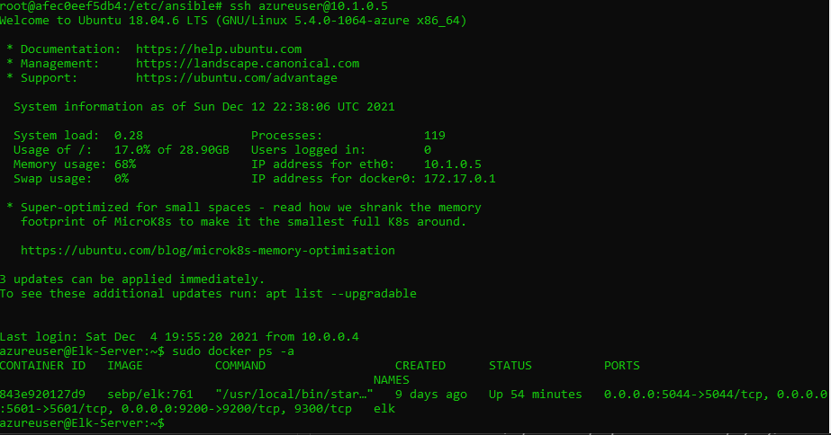

## Automated ELK Stack Deployment

The files in this repository were used to configure the network depicted below.

These files have been tested and used to generate a live ELK deployment on Azure. They can be used to either recreate the entire deployment pictured above. Alternatively, select portions of the _____ file may be used to install only certain pieces of it, such as Filebeat.

  - [setup.yml](Ansible/setup.yml)
  - [install-elk.yml](Ansible/install-elk.yml)
  - [install-filebeat.yml](Ansible/install-filebeat.yml)
  - [install-metricbeat.yml](Ansible/install-metricbeat.yml)

This document contains the following details:
- Description of the Topologu
- Access Policies
- ELK Configuration
  - Beats in Use
  - Machines Being Monitored
- How to Use the Ansible Build

### Description of the Topology

The main purpose of this network is to expose a load-balanced and monitored instance of DVWA, the D*mn Vulnerable Web Application.

Load balancing ensures that the application will be highly available in addition to restricting ssh to the network.
- _What aspect of security do load balancers protect? What is the advantage of a jump box?_
  - Availability of webservers
  - Jumpbox allows one access point

Integrating an ELK server allows users to easily monitor the vulnerable VMs for changes to the `configuration files` and system `logs`.
- _ What does Filebeat watch for?
  - changes in ssh logins, linux logins and sudo commands.
-  What does Metricbeat record?_
  - CPU, Ram and Network Usage.

The configuration details of each machine may be found below.
_Note: Use the [Markdown Table Generator](http://www.tablesgenerator.com/markdown_tables) to add/remove values from the table_.

| Name     | Function | IP Address | Operating System |
|----------|----------|------------|------------------|
| Jump Box | Gateway  | 10.0.0.4   | Linux            |
| Web-1     |Webserver|10.0.0.5    |    Linux         |
| WEb-2     |WEbserver|10.0.0.7|  Linux                |
| Elk     |Security Monitoring|10.1.0.5|    Linux              |

### Access Policies

The machines on the internal network are not exposed to the public Internet. 

Only the __`Jumpbox, and Webservers`___ machine can accept connections from the Internet. Access to this machine is only allowed from the following IP addresses:
- Add whitelisted IP addresses
  - Jumpbox: 166.70.123.127
  - Webservers: 10.0.0.4

Machines within the network can only be accessed by `Jumpbox`.
-  Which machine did you allow to access your ELK VM? What was its IP address?
  - ssh to Elk from Jumpbox: 10.0.0.4
  - http to Elk is: 166.70.123.127 

A summary of the access policies in place can be found in the table below.

| Name     | Publicly Accessible | Allowed IP Addresses |
|----------|---------------------|----------------------|
| Jump Box | Yes              | My Personal IP   |
| Web-1         |   Yes| Any                |
| Web-2         |  |   Yes    | Any |
| ELK        |  |   Yes    | My Personal IP|
### Elk Configuration

Ansible was used to automate configuration of the ELK machine. No configuration was performed manually, which is advantageous because...
- Less prone to human errors, and configure multiple servers simultaneously

The playbook implements the following tasks:
- _TODO: In 3-5 bullets, explain the steps of the ELK installation play. E.g., install Docker; download image; etc._
- Install docker.io
- Install python3-pip
- Install Docker module
- Increase more memory for ELK to run
- Download and launch a docker elk container

The following screenshot displays the result of running `docker ps` after successfully configuring the ELK instance.

### Target Machines & Beats
This ELK server is configured to monitor the following machines:
- 10.0.0.5
- 10.0.0.7

We have installed the following Beats on these machines:
- Filebeat
- Metribeat

These Beats allow us to collect the following information from each machine:
- _TODO: In 1-2 sentences, explain what kind of data each beat collects, and provide 1 example of what you expect to see. E.g., `Winlogbeat` collects Windows logs, which we use to track user logon events, etc._
= Filebeat monitors for ssh logins, linux logins, and sudo commands.
- Metricbeat monitors for CPU, RAM, and network usage.

### Using the Playbook
In order to use the playbook, you will need to have an Ansible control node already configured. Assuming you have such a control node provisioned: 

SSH into the control node and follow the steps below:
- Copy the `playbook` file to `/etc/ansible/roles`.
- Update the `hosts` file to include `webserver ips`
- Run the playbook, and navigate to `targeted machines` to check that the installation worked as expected.

_TODO: Answer the following questions to fill in the blanks:_
- _Which file is the playbook? Where do you copy it?_
  - `setup.yml` (Webserver playbook)
  - `install=elk.yml`
  - `install-filebeat.yml`
  - `install-metricbeat.yml`
- _Which file do you update to make Ansible run the playbook on a specific machine?_
  - `hosts` file

_How do I specify which machine to install the ELK server on versus which to install Filebeat on?_
  - Inside the yml file, we need to state which host to run the script on.

- _Which URL do you navigate to in order to check that the ELK server is running?
  - http://ELK-VM-IP:5601
  - http://20.118.201.222:5601/app/kibana
